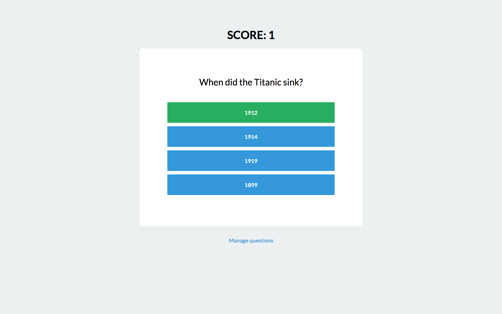
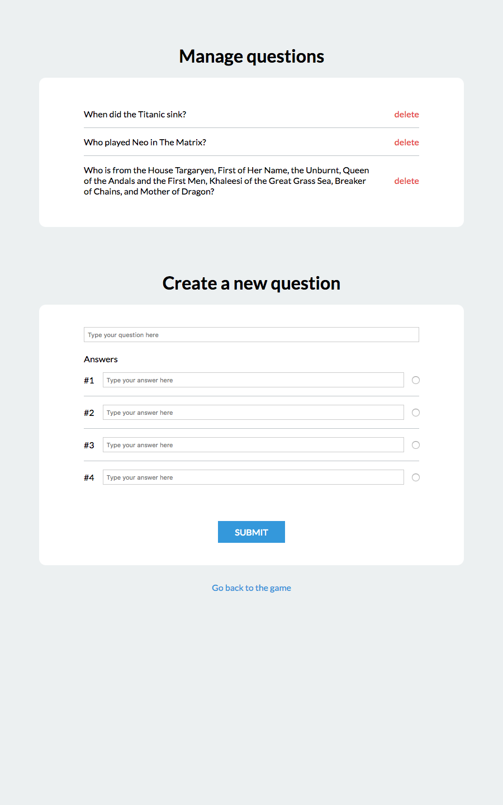

# Quiz application

You have to create a simple quiz website.

## Highlights

- The user is able to take a quiz
  - Getting different questions, one at a time
  - After selecting an answer, the correct answer is shown
  - New question displays after the previous one is answered
- The user is able to add new questions by providing:
  - a question
  - 4 possible answers
  - marking the right answer
- The user is able to delete questions by ID

## Initialize a new project

- use `npm init`
- you'll need to set up `express` and `mysql` as dependencies (use `--save`
  command line flag to automatically add the packages to your package.json)
- create `.gitignore` file for `node_modules` directory
- import the the MySQL database: [quiz_app.sql](data/quiz_app.sql)

## Frontend

The application consists of two screens.

### Game



- It should display the question at the bottom
- It should have 4 buttons with the answers
- It should mark the right or wrong answer by clicking in it
- And it should get a new random question (use `setTimeout()` for that)
- It should show your current score
  - First time it's 0, and every right answer increments it by one.
- It should have a link `manage questions` that points to
  `http://localhost:8080/questions`

### Manage questions



- It should show all the questions
- All questions should have a delete link
  - Clicking on it deletes the question
- It should have input fields below the questions:
  - Question
  - Answer 1
  - Answer 2
  - Answer 3
  - Answer 4
- The answers should have radio buttons for marking the right answer
- And a submit button for sending the new question to your database
- It should have a link `go back to the game` that points to
  `http://localhost:8080/game`

## Endpoints

### GET `/game`

It should render a static HTML, as a game page.

### GET `/questions`

It should render a static HTML, as a manage questions page.

### GET `/api/game`

This endpoint should return a random question with its answers.

*Example:*

```json
{
    "id": 2,
    "question": "When did the Titanic sink?",
    "answers": [
        {
            "question_id": 2,
            "id": 5,
            "answer_1": "1912",
            "is_correct": 1
        },
        {
            "question_id": 2,
            "id": 6,
            "answer_2": "1914",
            "is_correct": 0
        },
        {
            "question_id": 2,
            "id": 7,
            "answer_3": "1919",
            "is_correct": 0
        },
        {
            "question_id": 2,
            "id": 8,
            "answer_4": "1899",
            "is_correct": 0
        }
    ]
}
```

### GET `/api/questions`

This endpoint should return all the questions.

*Example:*

```json
[
    {
        "id": 1,
        "question": "Who played Neo in The Matrix?"
    },
    {
        "id": 2,
        "question": "When did the Titanic sink?"
    },
    {
        "id": 3,
        "question": "Who is from the House Targaryen, First of Her Name, the Unburnt, Queen of the Andals and the First Men, Khaleesi of the Great Grass Sea, Breaker of Chains, and Mother of Dragon?"
    },
    ...
]
```

### POST `/api/questions`

- If you fill the form and click on the submit button, it should add a new
  question and its answers

*Example:*

```json
{
    "question": "What is the lowest male voice?"
    "answers": [
        {
            "answer_1": "Bariton",
            "is_correct": 0
        },
        {
            "answer_2": "Bass",
            "is_correct": 1
        },
        {
            "answer_3": "Tenor",
            "is_correct": 0
        },
        {
            "answer_4": "Alt",
            "is_correct": 0
        }
    ]
}
```

### DELETE `/api/questions/:id`

- If you click on the delete link (which is next to the question)
- It should delete the question and its answers by id

### Endpoint Testing

- Test the rest endpoint for at least a status code and some part of the json
  content.
